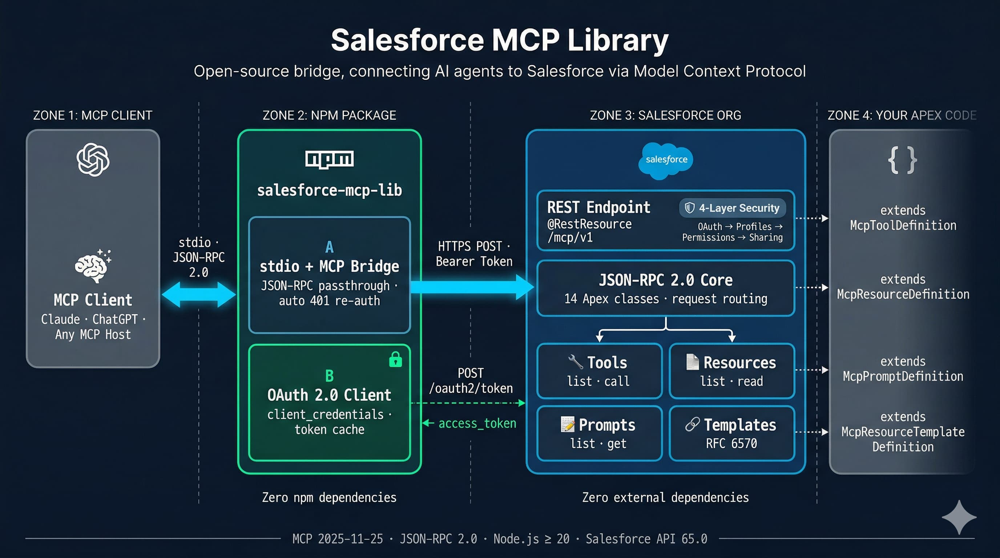

# Salesforce MCP Library

[](https://www.npmjs.com/package/salesforce-mcp-lib)
[](LICENSE)

Open-source bridge connecting AI agents to Salesforce via [Model Context Protocol](https://modelcontextprotocol.io/).



Two packages, zero external dependencies:

| Package | What it does | Install |
|---------|-------------|---------|
| **Apex framework** (2GP unlocked) | JSON-RPC 2.0 core + MCP server running natively in your Salesforce org | `sf package install` |
| **npm stdio proxy** | Bridges any MCP client to the Apex endpoint via OAuth 2.0 | `npx salesforce-mcp-lib` |

---

## How it works

1. **MCP Client** (Claude, ChatGPT, any MCP host) sends JSON-RPC 2.0 messages over **stdio**
2. **npm proxy** authenticates via OAuth 2.0 (client credentials or per-user login), forwards requests over HTTPS, and handles token refresh automatically
3. **Apex MCP Server** dispatches requests to your registered **tools**, **resources**, and **prompts** — all running inside Salesforce with full platform security

The Apex server is **stateless** — it rebuilds its handler chain on every request. No session cleanup, no state bugs, no cross-request data leakage.

### Security — 4 layers, 3 of them automatic

| Layer | Enforced by |
|-------|------------|
| OAuth 2.0 scopes | External Client App configuration |
| Profile permissions | Salesforce platform |
| Permission Sets | Salesforce platform |
| Sharing rules | Salesforce platform |

---

## Why External Client Apps

This library uses the OAuth 2.0 `client_credentials` flow and is runtime-agnostic about which Salesforce app container issued the credentials. The project documentation intentionally standardizes on **External Client Apps (ECA)** so setup guidance stays ahead of Salesforce's platform direction.

## Quick start

### 1. Install the Apex framework

```bash
sf package install --package 04tdL000000So9xQAC --target-org YOUR_ORG --wait 10
```

### 2. Create your MCP endpoint (2 Apex classes)

**Endpoint** — a `@RestResource` that wires up your capabilities. In this unlocked package, the framework API stays `public`; the endpoint itself is `global` because Apex REST entry points require it:

```apex
@RestResource(urlMapping='/mcp/minimal')
global inherited sharing class MinimalMcpEndpoint {
    @HttpPost
    global static void handlePost() {
        McpServer server = new McpServer();
        server.registerTool(new MinimalTool());
        server.handleRequest(RestContext.request, RestContext.response);
    }
}
```

**Tool** — extend the package's `public` `McpToolDefinition` base class and implement `inputSchema()`, `validate()`, `execute()`:

```apex
public inherited sharing class MinimalTool extends McpToolDefinition {
    public MinimalTool() {
        this.name = 'echo';
        this.description = 'Echoes the provided message back to the caller';
    }
    public override Map<String, Object> inputSchema() {
        return new Map<String, Object>{
            'type' => 'object',
            'properties' => new Map<String, Object>{
                'message' => new Map<String, Object>{
                    'type' => 'string',
                    'description' => 'The message to echo'
                }
            },
            'required' => new List<String>{ 'message' }
        };
    }
    public override void validate(Map<String, Object> arguments) {
        if (!arguments.containsKey('message')) {
            throw new McpInvalidParamsException('message is required');
        }
    }
    public override McpToolResult execute(Map<String, Object> arguments) {
        String msg = (String) arguments.get('message');
        McpToolResult result = new McpToolResult();
        result.content = new List<McpTextContent>{ new McpTextContent(msg) };
        return result;
    }
}
```

### 3. Configure an External Client App

**Option A — Client Credentials** (service account, no user interaction):
Create an External Client App with **OAuth 2.0 Client Credentials** flow. Note the `client_id` and `client_secret`.

**Option B — Per-User Auth** (individual identity, recommended):
Create an External Client App with **Authorization Code + PKCE** flow. Callback URL: `http://localhost:13338/oauth/callback`. Scopes: `api`, `refresh_token`. See [Per-User Auth Setup Guide](specs/003-per-user-auth/quickstart.md) for detailed steps.

### 4. Connect an AI agent

**Per-User Auth** (individual identity — recommended for Claude Code):

```bash
# One-time login in your terminal:
npx salesforce-mcp-lib login \
  --instance-url https://your-org.my.salesforce.com \
  --client-id YOUR_CLIENT_ID
```

Then add to Claude Code via `/mcp` → Add Server, or edit `~/.claude.json`:

```json
{
  "mcpServers": {
    "salesforce": {
      "command": "npx",
      "args": [
        "-y", "salesforce-mcp-lib",
        "--instance-url", "https://your-org.my.salesforce.com",
        "--client-id", "YOUR_CLIENT_ID",
        "--endpoint", "/services/apexrest/mcp/minimal"
      ]
    }
  }
}
```

**Client Credentials** (service account — existing behavior):

```json
{
  "mcpServers": {
    "salesforce": {
      "command": "npx",
      "args": [
        "-y", "salesforce-mcp-lib",
        "--instance-url", "https://your-org.my.salesforce.com",
        "--client-id", "YOUR_CLIENT_ID",
        "--client-secret", "YOUR_CLIENT_SECRET",
        "--endpoint", "/services/apexrest/mcp/minimal"
      ]
    }
  }
}
```

The auth mode is auto-detected: `--client-secret` present → client credentials, absent → per-user auth.

That's it. The agent can now discover and invoke your Salesforce tools.

`inherited sharing` and `with sharing` help enforce record-level access defaults, but they don't enforce CRUD/FLS by themselves. Use explicit security checks when your tool reads or writes protected fields or objects.

---

## All three MCP capabilities

Register tools, resources, and prompts in a single endpoint:

```apex
@RestResource(urlMapping='/mcp/e2e')
global inherited sharing class E2eHttpEndpoint {
    @HttpPost
    global static void handlePost() {
        McpServer server = new McpServer();
        server.registerTool(new ExampleQueryTool());
        server.registerResource(new ExampleOrgResource());
        server.registerPrompt(new ExampleSummarizePrompt());
        server.handleRequest(RestContext.request, RestContext.response);
    }
}
```

| Capability | Extend | Override |
|-----------|--------|---------|
| **Tool** | `McpToolDefinition` | `inputSchema()`, `validate()`, `execute()` |
| **Resource** | `McpResourceDefinition` | `read()` |
| **Resource Template** | `McpResourceTemplateDefinition` | `read(arguments)` |
| **Prompt** | `McpPromptDefinition` | `get(arguments)` |

See [`examples/`](examples/) for complete working code.

---

## CLI reference

### MCP Server Mode

```
salesforce-mcp-lib [options]
```

| Option | Env variable | Required | Description |
|--------|-------------|----------|-------------|
| `--instance-url` | `SF_INSTANCE_URL` | Yes | Salesforce org URL |
| `--client-id` | `SF_CLIENT_ID` | Yes | External Client App consumer key |
| `--client-secret` | `SF_CLIENT_SECRET` | No* | External Client App consumer secret |
| `--endpoint` | `SF_ENDPOINT` | Yes | Apex REST endpoint path |
| `--callback-port` | `SF_CALLBACK_PORT` | No | Local OAuth callback port (default: `13338`) |
| `--log-level` | `SF_LOG_LEVEL` | No | `debug` / `info` / `warn` / `error` (default: `info`) |

\* When `--client-secret` is provided → client credentials flow. When omitted → per-user auth (requires prior `login`).

### Login Subcommand (per-user auth)

```
salesforce-mcp-lib login [options]
```

| Option | Env variable | Required | Description |
|--------|-------------|----------|-------------|
| `--instance-url` | `SF_INSTANCE_URL` | Yes | Salesforce org URL |
| `--client-id` | `SF_CLIENT_ID` | Yes | External Client App consumer key |
| `--headless` | `SF_HEADLESS` | No | Print auth URL instead of opening browser |
| `--callback-port` | `SF_CALLBACK_PORT` | No | Local OAuth callback port (default: `13338`) |

---

## Tech stack

- **Apex**: Salesforce API 65.0 — 54 classes, zero external dependencies
- **TypeScript**: ES2022, Node.js >= 20 — 10 modules, zero npm production dependencies
- **Protocol**: MCP `2025-11-25`, JSON-RPC 2.0 — all 11 MCP methods implemented
- **Packaging**: Salesforce 2GP unlocked package (no namespace)

## Project structure

```
force-app/main/
  json-rpc/classes/    # JSON-RPC 2.0 core (14 classes)
  mcp/classes/         # MCP server framework (40 classes)
packages/salesforce-mcp-lib/
  src/                 # TypeScript stdio proxy (10 modules)
  tests/               # Unit tests
examples/
  minimal/             # Single-tool echo example
  e2e-http-endpoint/   # Tools + resources + prompts
scripts/               # Build, deploy, and release scripts
```

## Contributing

Contributions are welcome. Validate Apex changes in a fresh scratch org before submitting:

```bash
./scripts/org-create.sh your-alias
./scripts/org-test.sh
```

`org-create.sh` provisions a new scratch org, sets it as default, and deploys `force-app`. `org-test.sh` then runs the Apex test suite in that org. Run the existing TypeScript test suite as well before submitting:

```bash
cd packages/salesforce-mcp-lib && npm test && npm run lint
```

## License

[MIT](LICENSE)
